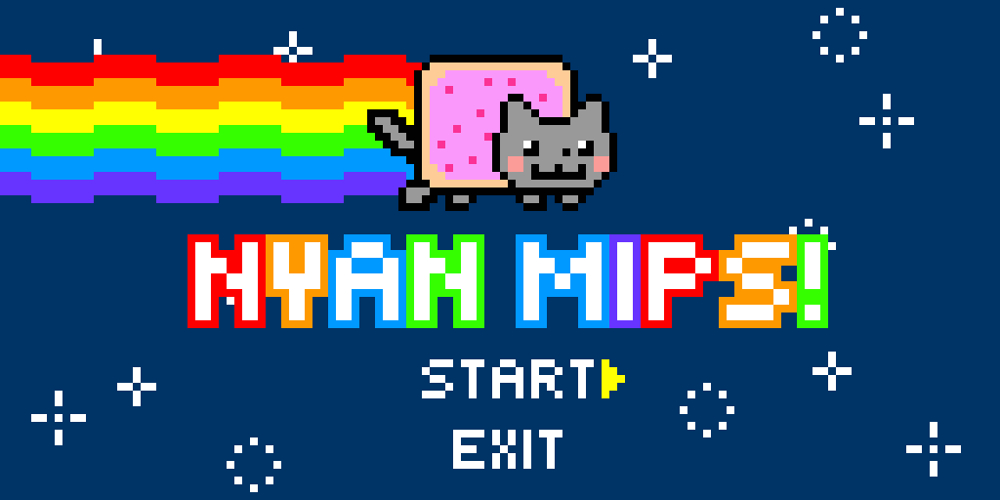
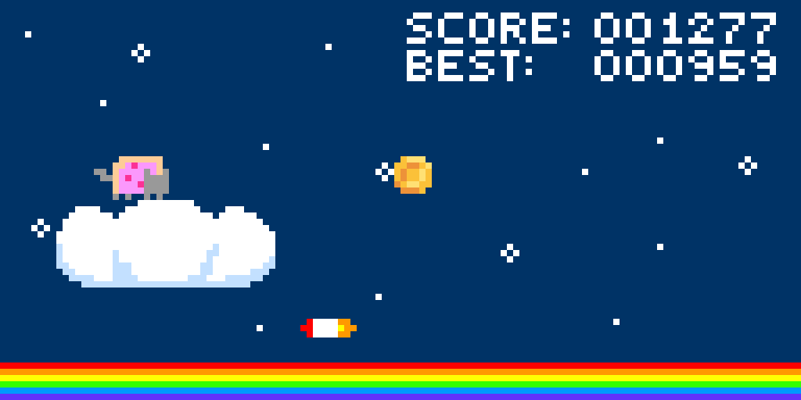

# Nyan-MIPS
Meow Meow Meow?

**Screenshots:**

**Strongly recommended:**

+ [https://www.youtube.com/watch?v=jIQ6UV2onyI](https://www.youtube.com/watch?v=jIQ6UV2onyI)

**The game is inspired by:**

+ [Nyan Cat](https://en.wikipedia.org/wiki/Nyan_Cat)
+ [Dinosaur Game (Chrome)](https://en.wikipedia.org/wiki/Dinosaur_Game)

**PS: To those studying CSCB58 after 2022 Winter**

You are allowed to download/copy/edit/use my image converter (`img.py`) and MIDI music file converter (`music.py`) for your own assembly projects if you want. Instructions for use are in the code comments. (I am pretty sure it is okay to use my converters according to the professor, but you have to write assembly functions by yourself to display the images and play the music.)

